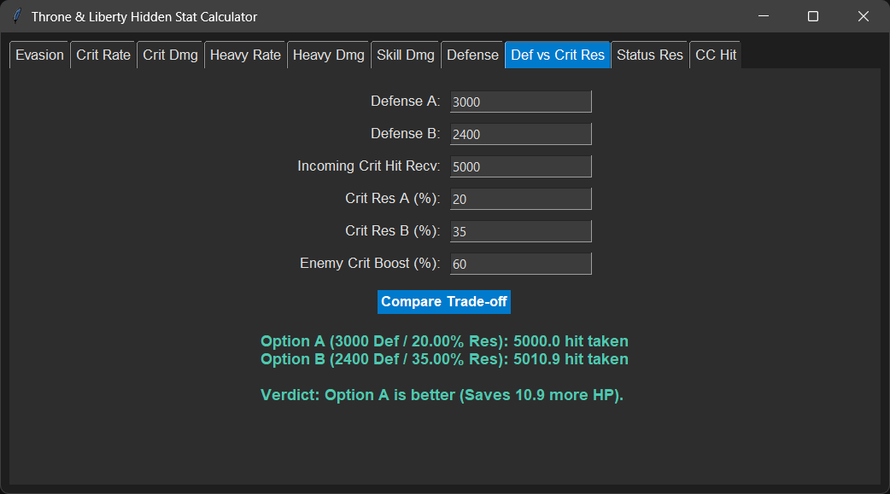

# Throne & Liberty Hidden Stat Calculator

A desktop application built with Python and Tkinter for analyzing combat formulas, hidden stat thresholds, and gear trade-offs in **Throne and Liberty**.

---

## Features

This calculator provides distinct tabs for analyzing both offensive and defensive mechanics:

* **Evasion:** Calculates your actual percentage chance to evade incoming attacks based on your Evasion vs. enemy Hit.
* **Crit Rate:** Determines your Critical Hit chance by comparing your Critical Hit stat against enemy Endurance.
* **Crit Dmg:** Calculates final critical damage output accounting for Critical Damage Boost % and enemy Critical Resistance %.
* **Heavy Rate:** Calculates your chance to land a Heavy Attack (double damage hit) based on Heavy Attack vs. Heavy Evasion.
* **Heavy Dmg:** Computes final heavy attack damage using base damage, Heavy Damage Boost %, and enemy Heavy Resistance %.
* **Skill Dmg:** Analyzes the net difference between Skill Damage Boost (SDB) and Skill Damage Resistance (SDR) and returns the net effective modifier percentage.
* **Defense:** Compares current vs. target Defense values to show raw mitigation changes and actual incoming damage reduction.
* **Def vs Crit Res:** A trade-off analyzer that tests two competing gear loadouts (Option A vs. Option B) against incoming critical hits to determine which setup saves more HP.
* **Status Res:** Calculates bonus or penalty percentage modifiers for status effect application based on Status Chance vs. Resistance.
* **CC Hit:** Calculates final Crowd Control (CC) landing and missing probabilities using skill base hit chance, attacker CC Chance, and target CC Resistance.

